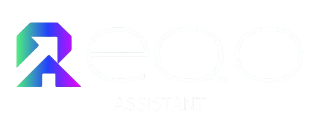
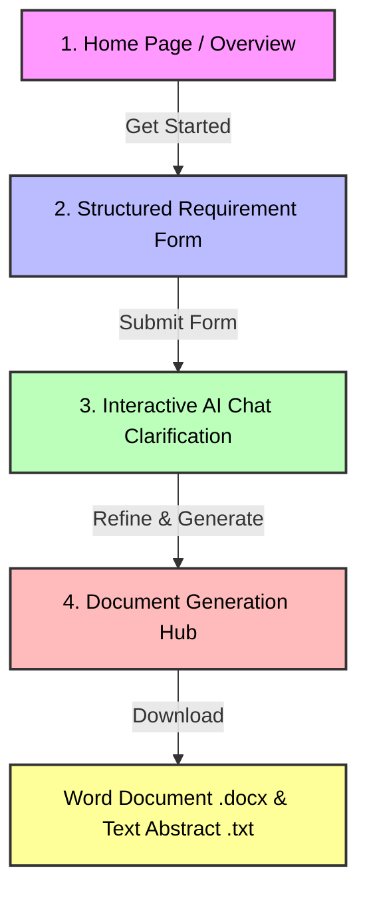

# 🚀 REQO Assistant: AI-Powered Requirement Engineering Tool

<p align="center">
  
</p>

<p align="center">
  <b>Collect • Clarify • Generate</b><br>
  Transform raw, ambiguous project ideas into structured, developer-ready software requirement documents in minutes.
</p>

<p align="center">
  <a href="https://www.python.org/"></a>
  <a href="https://streamlit.io/"></a>
  <a href="https://ai.google.dev/"></a>
  <a href="https://pandas.pydata.org/"></a>
  <a href="https://python-docx.readthedocs.io/"></a>
</p>

---

## 💡 Overview

**REQO Assistant** is a prototype software designed to bridge the gap between clients (who have vision but lack technical specifications) and development teams. 

Traditional requirement gathering can be slow and full of misunderstandings. REQO solves this by leading users through a structured questionnaire, clarifying ambiguity dynamically via an interactive AI agent, and automatically formatting the results into professional, downloadable requirement specifications (`.docx` & `.txt`).

---

## 🔄 How It Works & Application Flow

The system guides you step-by-step through a systematic requirement engineering pipeline:



### 1. Home Page
* Quick onboarding landing page highlighting how the tool operates.
* Instant redirect button to kick off the gathering process.

### 2. Structured Requirement Form
* Captures the foundational data including:
  * **Project Overview**: Purpose, problem statement, and product vision.
  * **Scope & Audience**: Target users and user goals.
  * **Features & Choice**: Core features, unique functionalities, platform selections, and tech stack preferences.
  * **Non-Functional Specifications**: Expected users count, performance requirements, and security compliance.
  * **Budget, Timelines, & Attachments**.

### 3. AI Clarification Chat (Powered by Gemini)
* REQO reads the submitted form details and initiates a smart chat session.
* Rather than starting from scratch, it asks highly contextual questions targeting gaps, ambiguities, and missing functional/non-functional details.
* When finished, the user triggers the Document Generation, prompting the model to compile the entire conversation history into an organized, validated JSON structure.

### 4. Document Generation Hub
* Automatically summarizes the project into a professional **Project Abstract**.
* Compiles the refined specifications into a styled Microsoft Word document (`requirement_document.docx`).
* Provides single-click downloads for both files.

---

## ⚡ Features

- 💬 **Dynamic AI Dialogue**: Conversational assistant powered by `gemini-2.5-flash` that acts as a business analyst.
- 📂 **Auto-Document Generation**: Generates clean, well-formatted `.docx` files on the fly utilizing `python-docx`.
- 🔐 **Admin Panel**: Role-based access enabling administrators to log in, review raw client submissions, and export aggregated data as CSV.
- 🎨 **Sleek Custom UI**: Tailored Streamlit styling, CSS-enhanced green action buttons, and responsive grid layouts.

---

## 🛠️ Tech Stack & Dependencies

* **Frontend & Navigation**: [Streamlit](https://streamlit.io/) (with modern multi-page navigation)
* **Programming Language**: [Python](https://www.python.org/)
* **AI Core**: [Google Gemini API](https://ai.google.dev/) (`google-generativeai`)
* **Document Engine**: [python-docx](https://python-docx.readthedocs.io/)
* **Data Manipulation**: [Pandas](https://pandas.pydata.org/) (used in the Admin Dashboard)

---

## 🚀 Getting Started

### Prerequisites
Make sure you have Python 3.10+ installed.

### 1. Clone the repository
```bash
git clone https://github.com/your-username/reqo_assistant.git
cd reqo_assistant
```

### 2. Install dependencies
```bash
pip install streamlit google-generativeai python-docx pandas
```

### 3. Set Up API Keys
Ensure you configure your Gemini API Key in `pages/chat.py` and `pages/document_gen.py`:
```python
genai.configure(api_key="YOUR_GEMINI_API_KEY")
```

### 4. Run the Application
Start the Streamlit development server:
```bash
streamlit run app.py
```
Open `http://localhost:8501` in your browser.

---

## 🔐 Admin Access
To test the admin functionality:
1. Go to the URL / page for Login (or programmatically assign role).
2. Use the credentials:
   - **Username**: `admin`
   - **Password**: `123`
3. The Admin Tab will appear in the navigation bar, allowing you to view and download all gathered requirements.
